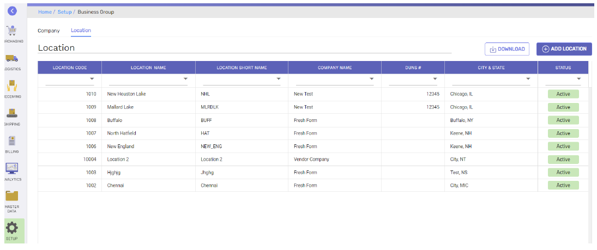
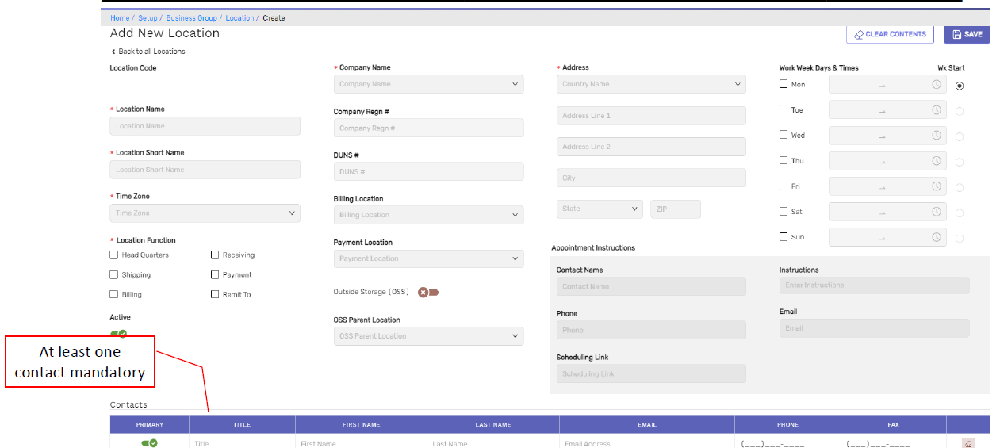
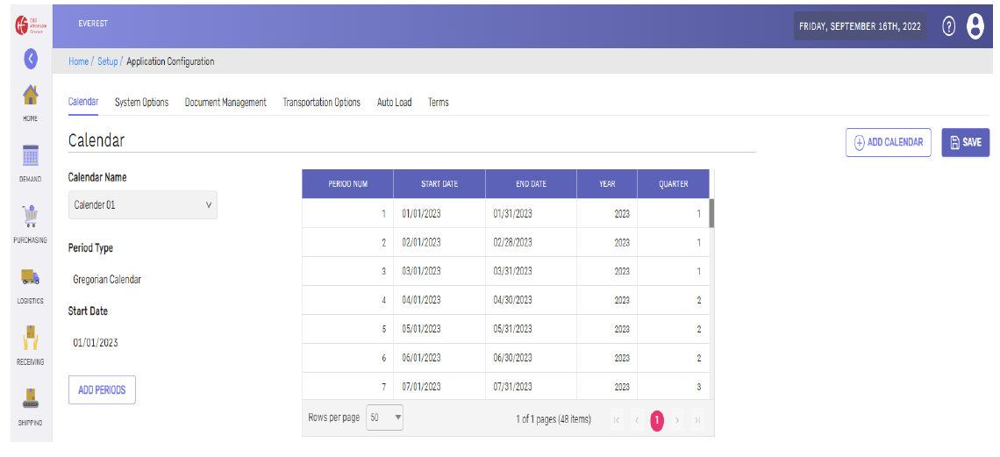
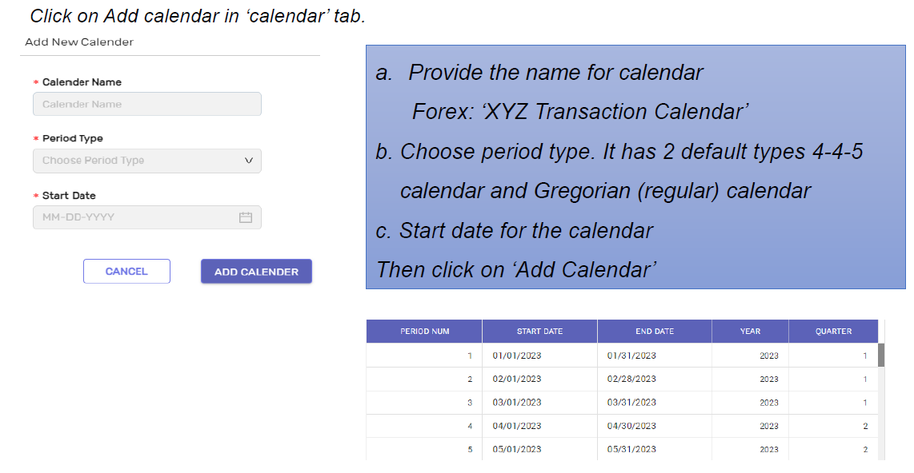
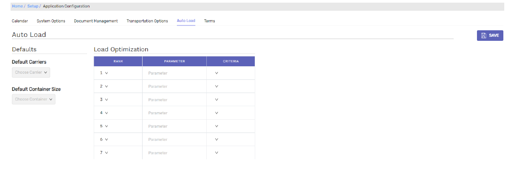

## Application Setup V1.0

### CONTENTS

- **Location**
- **Application Configuration**
- **Lookups**

____

### Location

**Navigation: Setup -> Business Group -> Location**

* Location section contains the summary information of all operating business locations defined for the client.
* Column positions can be changed, Data can be filtered and downloaded to excel using the download option

**How to define a new location?**

* New location can be defined by click on ‘Add Location’, which opens the location definition page

- All New location screen is to define operating business locations of the client

____

### APPLICATION CONFIGURATION

**Navigation: Setup -> Application Configuration**

**Calendar:**

Click on Add calendar in ‘calendar’ tab.

**System options:**

Click on system options tab to navigate and configure the system options that control the overall system for the client.

- All mandatory settings for this screen are marked and the labels are self explanatory
- Sequencing: Sequencing is for numbering sequence of locations, trading partners and partner business/operating unit configurations.
- Click on SAVE once the updates are done.

**Document Management:**

Click on document management tab to navigate and configure the transactional level number sequencing for the client.

- Document management section contains the transaction numbering preferences of the client for each of the transaction type applicable as per the client’s business type.
i.e. customer/vendor/carrier.
- Click on SAVE once numbering sequence is defined.

**Transportation Options:**

Click on Transportation options tab to navigate and configure the transportation shipping and receiving segments, container information.

- Transportation options controls the load management process of the customer as part of their transportation planning.
- Up to 4 Shipping and receiving segments can be defined based on the client’s geographic operations for transportation purposes.

**Auto Load:**

Click on Auto load tab to navigate and configure the options enables automatic load building and recommend the loads for the client to review and confirm.

**Terms:**

- Click on terms tab to navigate and configure the payment term information which eventually can assign to the trading partner records for billing due date calculation purposes.

- Terms section contains 2 parts, i.e.
  - Term Definition – contains the name and description of the term
  - Term lines definition – Select the term definition to see the details of the term lines

Click on SAVE once the term is defined.

_____

### LOOKUPS

**Navigation: Setup -> Lookups**

Lookups, as the name suggests they are values that are common at multiple places. These lookup values are referred at multiple master data or transactional data screens so that they appear as dropdown list of values to choose from.

Also for some of these lookups, there is a flexibility of extending the list of values by client as needed.